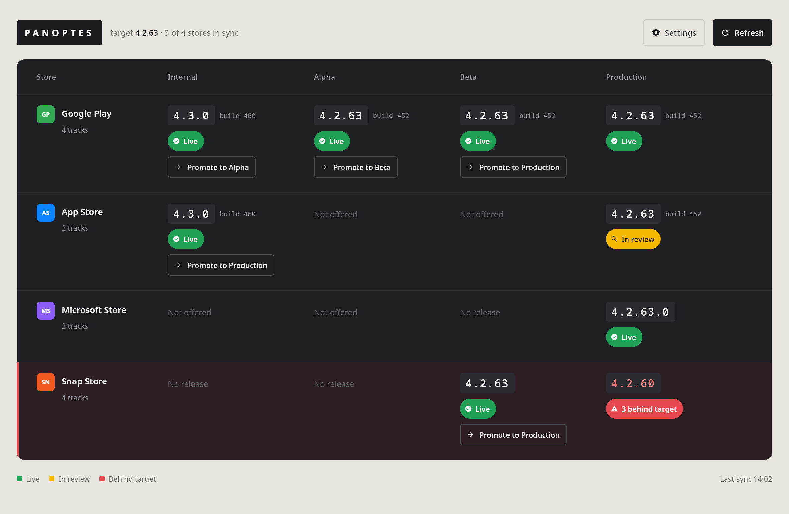

# Panoptes

See and promote your app's releases across **Google Play**, the **App Store**, the **Microsoft Store**, the **Snap Store** and a self-hosted **macOS DMG** from one place.

Panoptes shows which version is live on each store's tracks (internal, alpha, beta, production) and lets you promote a build to the next track. It comes as a terminal CLI and as a Compose desktop app, both written in Kotlin Multiplatform.



## Features

- **One dashboard for every store.** See the version and status (live, in review, …) of each track, and spot stores that are behind.
- **Promote builds** to the next track (internal → alpha → beta → production).
- **Settings per project.** Each app keeps its own `.panoptes/` folder, and its credentials are kept locally and encrypted.
- **Reads your CI `.env`.** If the project already has a [dotenvx](https://dotenvx.com) `.env`, Panoptes uses those credentials directly.

| Store           | View versions | Promote |
|-----------------|:-------------:|:-------:|
| Google Play     | ✓             | ✓       |
| App Store       | ✓             | ✓ (submits for review) |
| Microsoft Store | ✓             | ✗ (the API needs the package re-uploaded) |
| Snap Store      | ✓             | ✓       |
| macOS DMG       | ✓             | ✗ (self-hosted: upload the DMG to your server) |

## Requirements

- Java 21+ (Gradle downloads a JDK 21 toolchain to build)
- [dotenvx](https://dotenvx.com), only if you use `.env` mode

## Install

```sh
make install     # installs `panoptes` and `panoptes-cli` into ~/.local/bin
make uninstall
```

Set `PREFIX=/some/path` to install somewhere else.

## Usage

Run Panoptes from your app's folder:

```sh
panoptes        # desktop app
panoptes-cli    # terminal CLI
```

From a checkout, without installing:

```sh
./run.sh            # desktop app
./run.sh --cli      # terminal CLI
```

Panoptes opens the closest folder, the current one or a parent, that contains a `.panoptes/` folder or a `.env` file. Your home folder is skipped. To open a different project, pass `--project <dir>` or set `PANOPTES_PROJECT`.

## Configuration

### App identifiers: `.panoptes/config.toml`

This file has no secrets and is meant to be committed:

```toml
[app]
googlePlayPackageName = "com.example.app"
appStoreBundleId      = "com.example.app"
windowsStoreId        = "9XXXXXXXXXXX"
snapName              = "my-snap"
dmgReleaseUrl         = "https://example.com/api/desktop_releases/mac-arm64"
```

The settings screen writes this file on the first run.

### Credentials

Panoptes reads credentials from one of two places.

**1. Encrypted store (default).** Enter your credentials in the settings screen. They're saved to `.panoptes/credentials.enc`, encrypted with AES-256-GCM and a key derived from a master password (PBKDF2). Panoptes git-ignores the file for you and warns you if git would commit it.

| Store           | What you need |
|-----------------|---------------|
| Google Play     | Service account JSON with access to the app |
| App Store       | App Store Connect API issuer ID, key ID and `.p8` key |
| Microsoft Store | Azure AD tenant ID, client ID and client secret (Partner Center app) |
| Snap Store      | `snapcraft export-login` output |
| macOS DMG       | Nothing: the release URL is public |

**2. `.env` mode.** If the project's `.env` sets any of the variables below, Panoptes decrypts it with `dotenvx get` and uses those credentials read-only, with no master password. These are the same variable names a typical CI setup uses:

| Variable | Store |
|----------|-------|
| `PUBLISH_PLAY_CONFIG_JSON` (base64 or plain) | Google Play |
| `APPSTORE_ISSUER_ID`, `APPSTORE_KEY_ID`, `APPSTORE_PRIVATE_KEY_BASE64` | App Store |
| `MS_STORE_TENANT_ID`, `MS_STORE_CLIENT_ID`, `MS_STORE_CLIENT_SECRET` | Microsoft Store |
| `SNAPCRAFT_STORE_CREDENTIALS` | Snap Store |

To copy the environment's credentials into the encrypted store instead, run `panoptes-cli --import-env`.

> Never commit `credentials.enc`, a plain `.env`, or `.env.keys`.

## Development

```sh
./gradlew :core:jvmTest          # unit tests
./gradlew :core:fatJar           # CLI jar → core/build/libs/panoptes-1.0.0.jar
./gradlew :desktop:run           # desktop app
```

The code is split into two modules:

- `core`: domain model, store adapters (`adapter/`), credential storage and config (`infrastructure/`), and the CLI (`ui/Cli.kt`)
- `desktop`: the Compose Multiplatform desktop app, which depends on `core`

The integration tests call the real store APIs and are skipped by default. To run them, set `PANOPTES_INTEGRATION_TESTS=true` and `PANOPTES_PROJECT=<project dir>`. If that project has no `.env`, also set `PANOPTES_MASTER_PASSWORD`.

See [specs.md](specs.md) and [implementation_plan.md](implementation_plan.md) for the design notes.
